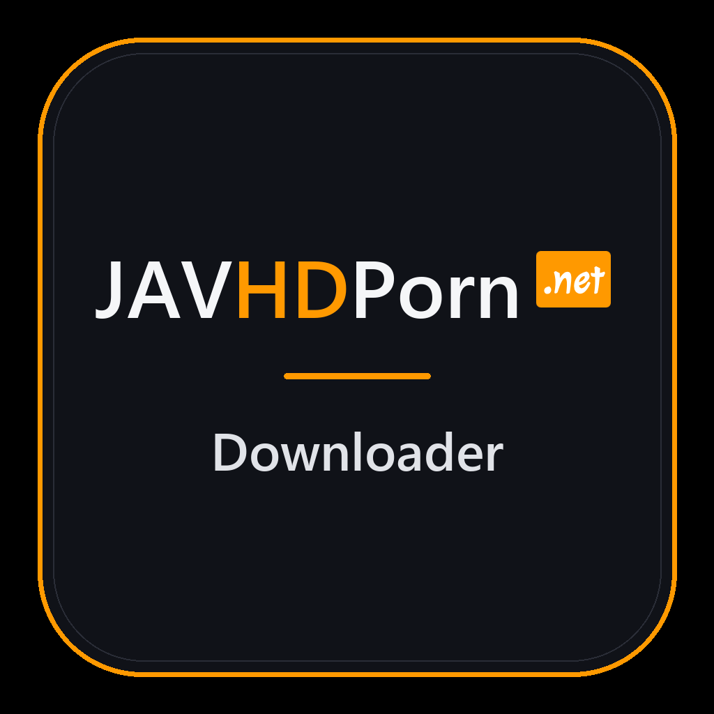

# JAVHDPorn Downloader

  

**Download individual public JAVHDPorn video pages as playable MP4 files from one focused Windows app.**

## Download

Download the latest Windows installer from the [Releases page](https://github.com/ZoneJ561/JAVHDPorn-Downloader/releases/latest).

JAVHDPorn Downloader is designed for a simple workflow: paste an individual supported video-page URL, choose where to save it, and download the best available quality as a validated MP4. Python and the required media tools are bundled with the installer.

## Features

### Video Downloads

- Download individual public JAVHDPorn video pages.
- Resolve the public player through the bundled WebView2 integration.
- Select the best available stream quality automatically.
- Display download progress, speed, and status.
- Cancel an active download when needed.
- Choose any destination folder for completed videos.

### Protected Stream Support

- Decode the site's image-wrapped HLS media fragments automatically.
- Strip non-video wrappers before joining media segments.
- Retry incomplete or interrupted fragment responses.
- Reject missing, truncated, or invalid fragments.
- Remux clean H.264 and AAC streams into a playable MP4.
- Remove temporary fragments after completion or failure.

### Desktop Experience

- Choose Light, Dark, or branded Icon themes.
- Remember the selected theme between launches.
- Open the destination folder directly from the app.
- Use a self-contained Windows installation with no separate Python setup.
- Launch from the Start Menu or an optional desktop shortcut.

### Safety And Validation

- Accept only individual supported video-page URLs.
- Require confirmation that the user is an adult and has the right to save the video.
- Validate completed media before reporting a successful download.
- Keep the downloader separate from unrelated archiving applications.

## Getting Started

1. Download and run the latest installer from the [Releases page](https://github.com/ZoneJ561/JAVHDPorn-Downloader/releases/latest).
2. Launch **JAVHDPorn Downloader** from the Start Menu or desktop shortcut.
3. Paste one individual supported video-page URL.
4. Choose a save folder and confirm the rights notice.
5. Select **Download video** and wait for MP4 finalization.

## Platform Support

| Platform | Status |
| --- | --- |
| Windows 10/11 x64 | Available |
| macOS | Not available |
| Linux | Not available |

## Important Note

Use JAVHDPorn Downloader only for public videos that you own or have explicit legal permission to save. You are responsible for following copyright law, local regulations, and the terms that apply to the websites and content you access.

JAVHDPorn Downloader is an independent project. It is not affiliated with, sponsored by, or endorsed by JAVHDPorn or its operators. Website changes may temporarily affect downloader functionality.

## Project Updates And Support

- Follow the project creator on Instagram: [@god1ynigga](https://instagram.com/god1ynigga)

## About This Repository

This is the public release page for JAVHDPorn Downloader. Downloadable installers are published through [GitHub Releases](https://github.com/ZoneJ561/JAVHDPorn-Downloader/releases). The application source code and private build workflow are maintained separately.
